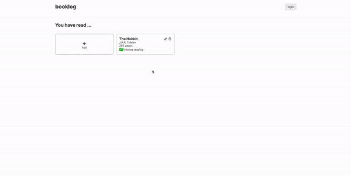

# Library

Live preview: https://taewookim02.github.io/library/

A web-based application to manage a personal library of books.

## Features

- Add a new book to the library with book title, author, number of pages, and whether you've read it or not.
- Edit an existing book in the library.
- Delete a book from the library.
- View a list of all books in the library.

## Technologies Used

- HTML, CSS and JavaScript
- Event handling and DOM manipulation with JavaScript
- Use of CSS Flexbox/Grid for styling
